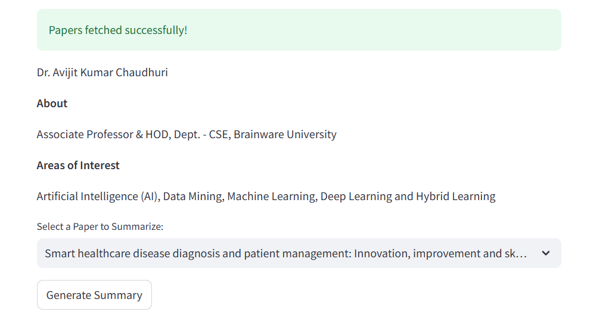
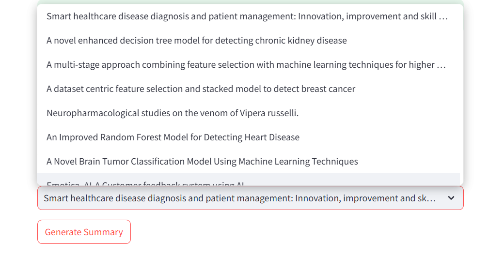
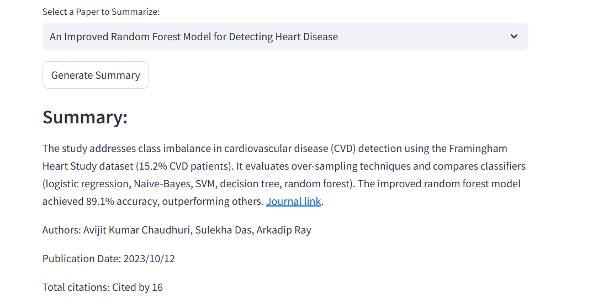

# Scholarly

An Automated Publication Summarizer for Faculty Members' Profile Building

## Objectives
1. Extract data from various sources such as research databases (e.g., DBLP, Google Scholar), institutional repositories, or personal publication records.

2. Automate the process of generating publication summaries for faculty members, researchers, and accrediting agencies (e.g. NBA, NAAC, AICTE) for HEIs.

## Preview
1. Scholarly main page: Just share your Google Scholar profile link to get started


2. Fetch user's basic information


3. Select your desired article to generate summary


4. Generated Summary


## Technical Set-up
1. Implemented Python 3.12.1 for web scraping logic, handling extracted data, and utilizing libraries like Selenium, BeautifulSoup, langchain, and requests. Used **Selenium WebDriver** to extract dynamic content, including interacting with elements, and clicking buttons for complete data retrieval.
2. Download latest version of [ChromeDriver](https://googlechromelabs.github.io/chrome-for-testing/)
3. **Install necessary libraries:**
```
   pip install selenium time beautifulsoup4 requests nltk networkx numpy transformers torch
```

